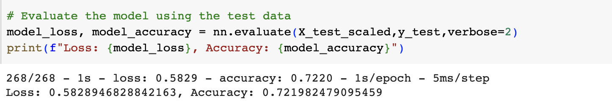

# Deep-Learning-Challenge

## Overview
Alphabet Soup needs to identify and select the most promising applicants to fund out of many applications, and they want to determine who is most likely to succeed if given funding. In order to optimize this selection process, we will build and train a binary classification model that uses a neural network algorithm to predict whether applicants will succeed or fail if funded by Alphabet Soup. 

The neural network model will take historical application data that contains features about applicants and their ventures, and it will analyze patterns in the features of past applicants who ultimately succeeded versus those who failed after receiving funding. By detecting predictive relationships between the application features and success/failure outcomes, the model will learn how to classify new applicants into two groups - those likely to succeed if funded, and those not likely to succeed from the funding. 

Alphabet Soup can then use the probability scores assigned by the neural network model to new applicants in order to select and prioritize the applicants with the highest chances of success for funding. This data-driven approach will enable Alphabet Soup to optimize its process for evaluating funding applications and identifying the applicants with the best opportunity for venture success.

## Results
 - **Data Preprocessing**
    - What variable(s) are the target(s) for your model?
        - Target variable: IS_SUCCESSFUL
    - What variable(s) are the features for your model?
        - Feature variables: APPLICATION_TYPE, AFFILIATION, CLASSIFICATION, USE_CASE, ORGANIZATION, STATUS, INCOME_AMT, SPECIAL_CONSIDERATIONS, ASK_AMT
    - What variable(s) should be removed from the input data because they are neither targets nor features?
        - Neither targets nor features: EIN and NAME

- **Compiling, Training, and Evaluating the Model**
    - How many neurons, layers, and activation functions did you select for your neural network model, and why?
    
    - For the initial model, he network design choices align with best practices for a binary classifier on tabular data - the model has the right output setup for the problem. The depth and width of the hidden layers provide enough representational power while minimizing unnecessary complexity that could overfit.
    - Were you able to achieve the target model performance?
    
    - No. The initial model only reached 72% accuracy.

    ### Optimizations
    - What steps did you take in your attempts to increase model performance?
     
     
    - *Optimization 1*
     
      
    - Increase APPLICATION_TYPE data
    - Increase CLASSIFICATION data
     
     
    
    - For the first optimization, I decided to only increase the size of the data to see how much that would increase accuracy. There was an increase in accuracy from the initial results (72.69%) to optimization 1 (73.13%) even with the addition of more data. The improvements from optimization 1 show that the model architecture and optimization were appropriate for the dataset and benefited from more data.
     
     
    - *Optimization 2*
     
      
    - I changed the model architecture to have wider hidden layers - 100 and 50 nodes vs 80 and 30 previously.
    - This increased the total parameters to 9,801 from 6,221 - the larger model has more representational capacity.
     
     
    
    - Overall, the minor 0.2% gain in accuracy indicates increasing model width did not provide substantial benefit. The similar loss shows the optimization did not improve generalization.
     
     
    - *Optimization 3*
     
     
     
     
    - Add INCOME_AMT data
     
      
    - I significantly expanded the model with much wider hidden layers of 300, 200, and 50 nodes.
    - This dramatically increased the total parameters to 82,301 from 9,801 previously.
    - However, the test accuracy decreased to 72.20% from 73.11% with the smaller model, and the loss also increased to 0.5829 from 0.5592.
     
     
    
    - Simply adding more data and making the neural network much larger does not automatically improve performance if overfitting is not controlled through regularization.

    ## Summary

    The deep neural network model achieved an accuracy of around 73% on the test set after a few optimization iterations. While reasonable, there is still room for improvement in accurately predicting successful funding applicants.

    I would recommend exploring a random forest classifier as an alternative model for this problem. Random forests naturally resist overfitting through bagging, and can learn nonlinear relationships like neural networks. The neural network appears to have potential with further tuning and regularization, but random forest could provide a strong benchmark solution.

